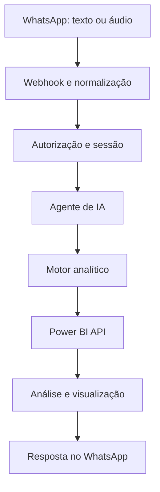

# Conversational BI Agent with n8n, Power BI & LLMs

> Assistente conversacional de Business Intelligence que transforma perguntas em linguagem natural em consultas analíticas, respostas executivas e visualizações, com orquestração no n8n.

[](https://n8n.io/)
[](https://powerbi.microsoft.com/)
[](#)
[](LICENSE)

## Visão geral

Este projeto demonstra a arquitetura de um agente de BI conversacional integrado ao WhatsApp. A solução recebe perguntas por texto ou áudio, mantém o contexto da conversa, interpreta filtros e métricas, consulta modelos do Power BI e devolve análises e gráficos de forma automatizada.

O repositório contém uma **versão demonstrativa e sanitizada para portfólio**. Prompts de produção, bibliotecas DAX, regras de negócio, mapeamentos, endpoints e credenciais foram deliberadamente removidos.

## Problema resolvido

Consultas recorrentes a indicadores normalmente dependem da abertura de dashboards e da aplicação manual de filtros. O projeto cria uma interface conversacional para que usuários autorizados consultem dados usando perguntas como:

- “Qual foi o faturamento do último mês?”
- “Compare as unidades no período.”
- “Quais categorias tiveram maior crescimento?”
- “Gere um gráfico com a evolução semanal.”

## Arquitetura



O fluxo de produção também utiliza transcrição de áudio, memória conversacional e persistência de contexto. Esses componentes aparecem apenas de forma conceitual nesta versão pública.

## Principais capacidades

- Entrada por texto e áudio
- Controle de acesso por usuário
- Memória e contexto de conversa
- Interpretação de períodos, métricas e dimensões
- Seleção dinâmica do modelo analítico
- Construção e execução de consultas DAX
- Geração de análises executivas
- Criação automática de gráficos
- Entrega da resposta pelo WhatsApp
- Tratamento de erros e observabilidade

## Tecnologias

- n8n
- Power BI REST API
- DAX
- JavaScript
- LLMs e prompt engineering
- PostgreSQL
- APIs REST e webhooks
- Integração com WhatsApp
- Transcrição de áudio

## Conteúdo do repositório

```text
.
├── workflows/
│   ├── agent-demo.json
│   └── powerbi-engine-demo.json
├── docs/
│   ├── architecture.md
│   └── publishing-checklist.md
├── examples/
│   └── sample-conversation.md
├── .gitignore
├── LICENSE
├── SECURITY.md
└── README.md
```

## Como explorar

1. Leia [a arquitetura](docs/architecture.md).
2. Consulte o [exemplo de conversa](examples/sample-conversation.md).
3. Importe os arquivos da pasta `workflows` no n8n apenas para visualizar o desenho demonstrativo.
4. Observe os nós marcados como lógica proprietária omitida.

> Os workflows públicos não são uma aplicação pronta para produção. Eles não contêm credenciais, prompts completos, endpoints, biblioteca DAX nem regras comerciais.

## Limites da versão pública

| Disponível | Omitido |
|---|---|
| Arquitetura geral | Prompts de produção |
| Organização dos fluxos | Biblioteca DAX |
| Tecnologias utilizadas | Regras de roteamento |
| Exemplos fictícios | Mapeamentos empresariais |
| Nós demonstrativos | Endpoints e IDs reais |
| Decisões de segurança | Credenciais e segredos |

## Segurança

Nenhuma credencial deve ser inserida diretamente em nós exportados. Em uma implementação real, utilize o gerenciador de credenciais do n8n ou variáveis de ambiente e revise todo JSON antes de versioná-lo.

Consulte [SECURITY.md](SECURITY.md) e o [checklist de publicação](docs/publishing-checklist.md).

## Autor

Desenvolvido por [Marcelo](https://github.com/marceloleicam) como projeto de portfólio em Dados, Business Intelligence, Automação e Inteligência Artificial.

## Licença

Uso exclusivo para avaliação e demonstração de portfólio. Cópia, redistribuição, modificação ou exploração comercial não são autorizadas sem permissão prévia. Consulte [LICENSE](LICENSE).
