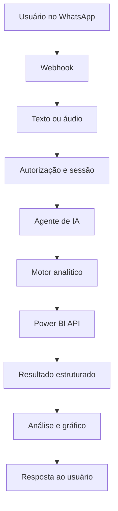
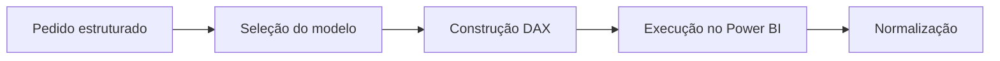

# Arquitetura da solução

## Visão funcional

## Camada conversacional

Responsável por receber mensagens, normalizar texto e áudio, validar o usuário,
manter o contexto da sessão e identificar a intenção analítica.

Na implementação de produção, a camada interpreta:

- empresa ou contexto selecionado;
- intervalo de datas;
- unidade ou filial;
- métrica solicitada;
- dimensão de análise;
- necessidade de tabela, ranking, comparação ou gráfico.

As regras, prompts e códigos dessa camada são proprietários e não estão
presentes neste repositório.

## Motor analítico

O motor recebe uma solicitação estruturada, seleciona o modelo semântico
adequado, produz a consulta analítica, executa a chamada autorizada e normaliza
o resultado.

A versão de produção contém bibliotecas DAX e mapeamentos específicos que foram
substituídos por nós demonstrativos.

## Persistência e contexto

Uma implementação completa pode utilizar PostgreSQL para memória de conversa,
controle de sessão, auditoria e correlação das solicitações. O esquema real não
é publicado.

## Geração de resposta

Após a consulta, o fluxo transforma dados tabulares em:

- resposta executiva em linguagem natural;
- comparação com períodos anteriores;
- rankings;
- alertas de variação;
- tabelas;
- gráficos enviados ao canal de atendimento.

## Fronteira público × privado

| Camada | Versão pública | Produção privada |
|---|---|---|
| Entrada | Estrutura conceitual | Webhook e integração reais |
| Autorização | Exemplo fictício | Políticas e usuários reais |
| Agente | Nó indicativo | Prompt e ferramentas completos |
| DAX | Nó indicativo | Biblioteca e regras completas |
| Power BI | Nó indicativo | Autenticação, IDs e endpoints |
| Dados | Valores fictícios | Dados corporativos |
| Saída | Exemplo textual | Mensagem e gráfico operacionais |
